# Smart Quiz Builder & Analytics Dashboard

A fully client-side **Quiz Builder & Analytics Dashboard** built using **HTML, CSS, and Vanilla JavaScript**.  
This application allows users to create MCQ-based quizzes, attempt them in a play/preview mode, and analyze performance using built-in analytics — all without any backend or libraries.

---

## Project Overview

The **Smart Quiz Builder & Analytics Dashboard** enables users to:

- Create quizzes with multiple MCQ questions
- Attempt quizzes in a timed play mode
- Instantly view scores and detailed results
- Track quiz analytics such as total attempts and average score
- Analyze question-wise accuracy using visual indicators

---

## Features

### Quiz Builder
- Create multiple quizzes
- Add MCQ questions with:
  - Question text
  - Multiple options
  - Correct answer selection
-  Edit questions
-  Delete questions
-  Input validation for all fields

### Quiz Play Mode
- Play quiz in preview / attempt mode
- Timer per quiz
- Instant score calculation

### Result Summary
- Total questions
- Correct answers
- Wrong answers
- Skipped questions
- Final score

### Analytics Dashboard
- Total attempts per quiz
- Average score
- Question-wise accuracy

---

## Screenshots

### Quiz Builder Dashboard
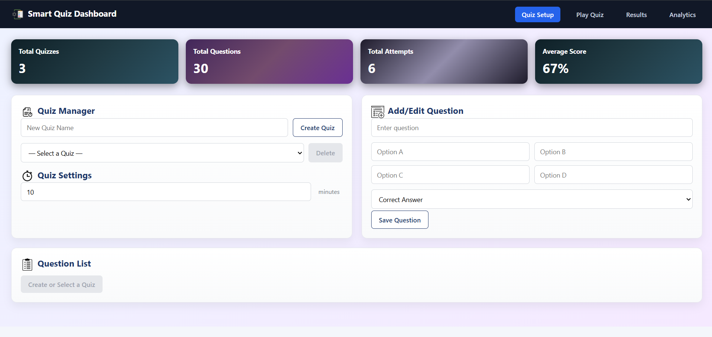

### Create Quiz
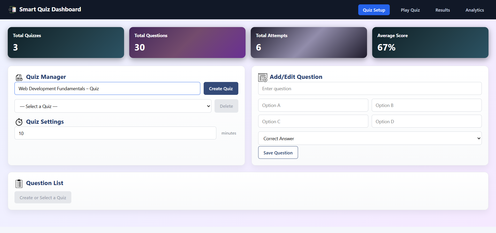

### Select Quiz
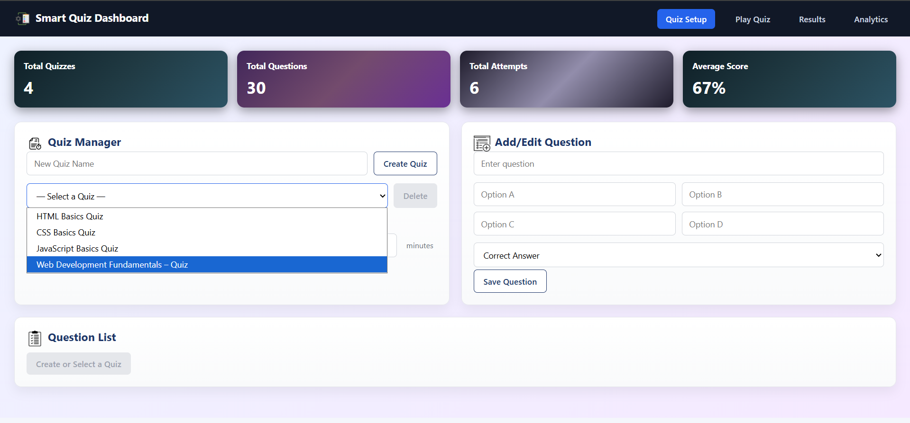

### Add Time Per Quiz
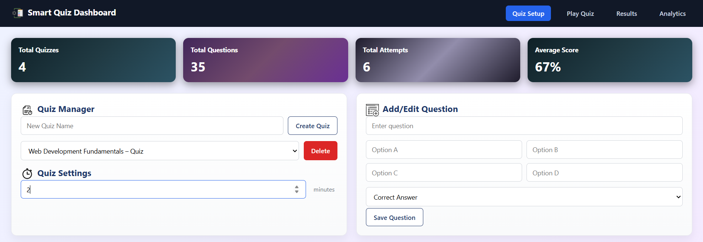

### Add / Edit MCQ Question
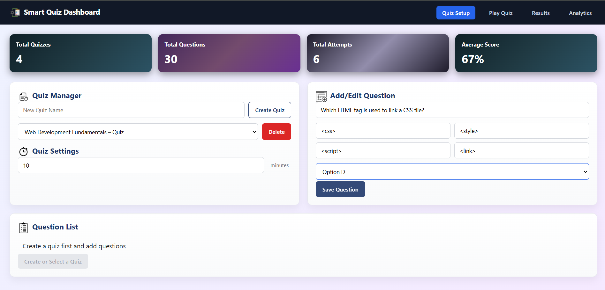

### Qustion List
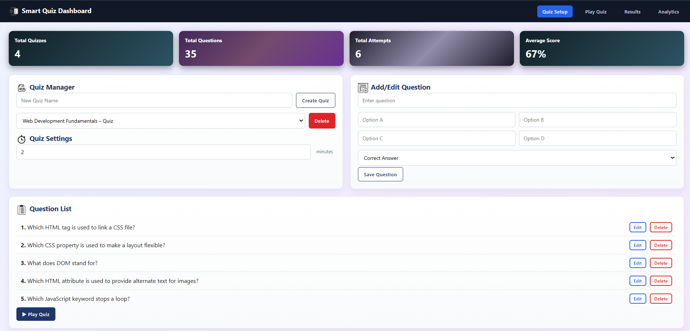

### Quiz Play Mode
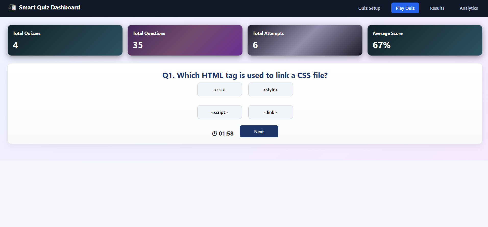

### Quiz Completed Popup Modal
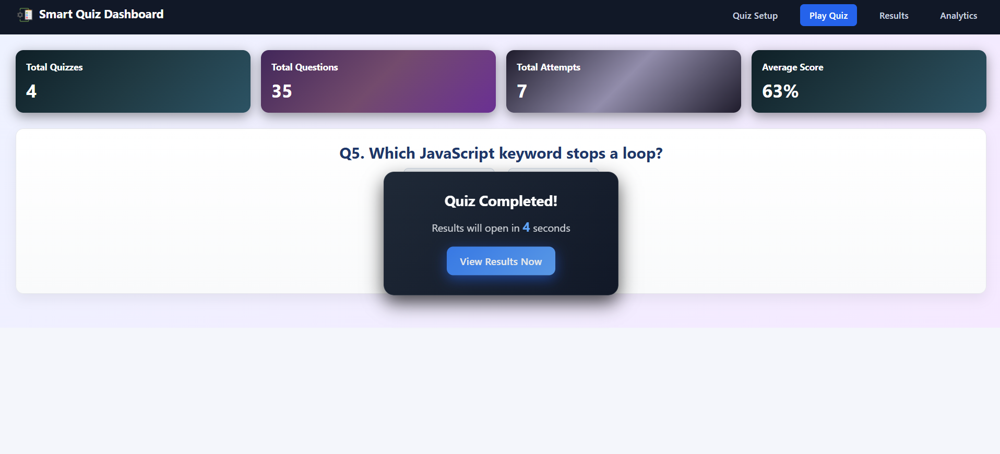

### Result Summary
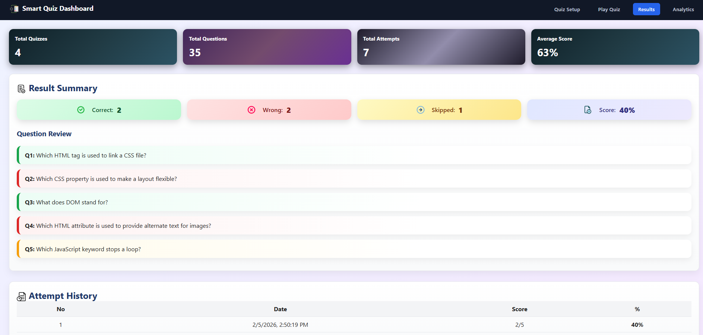

### Analytics Dashboard (One Attempt/Multiple Attempts)
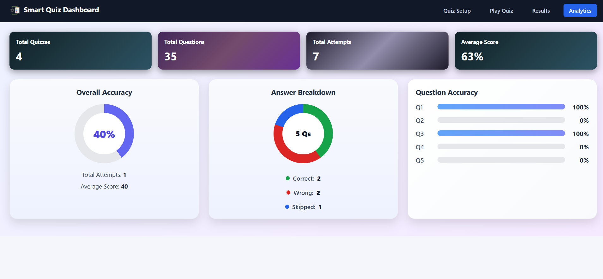

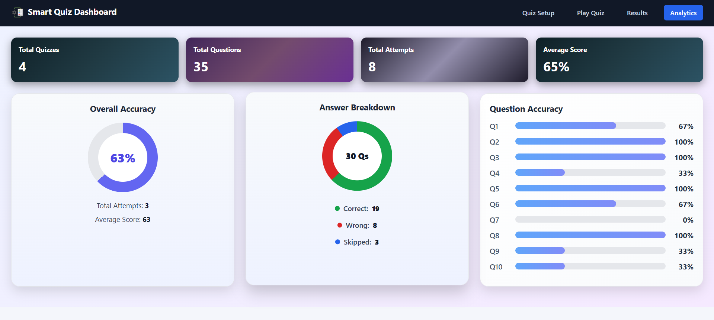
